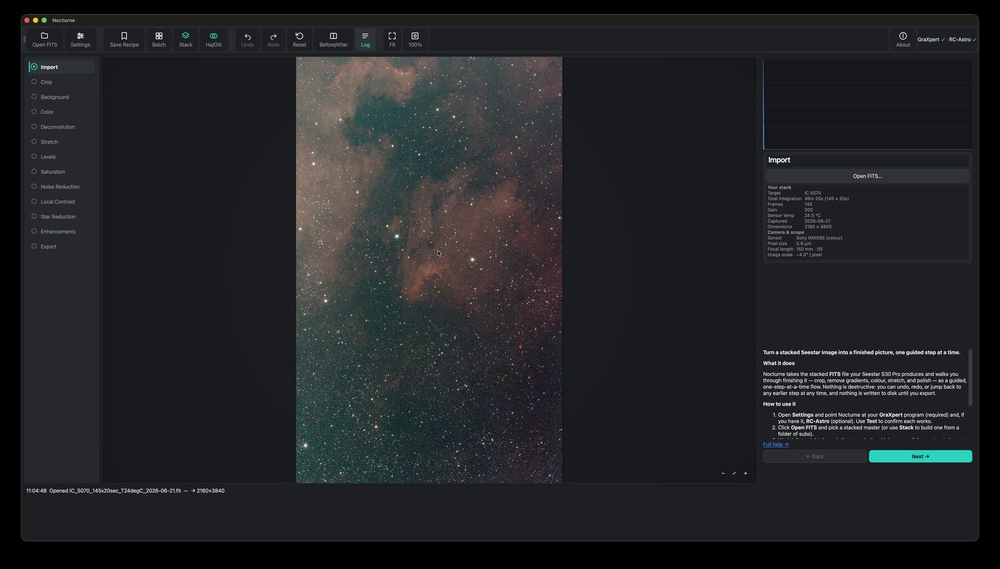
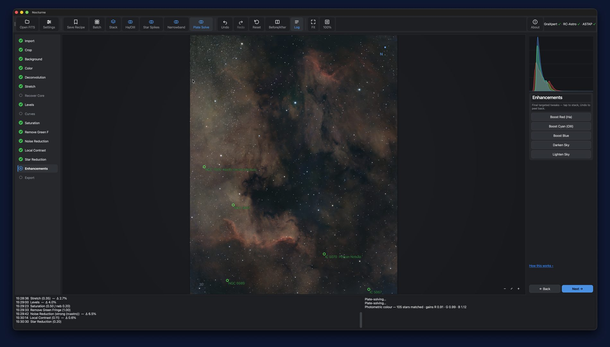
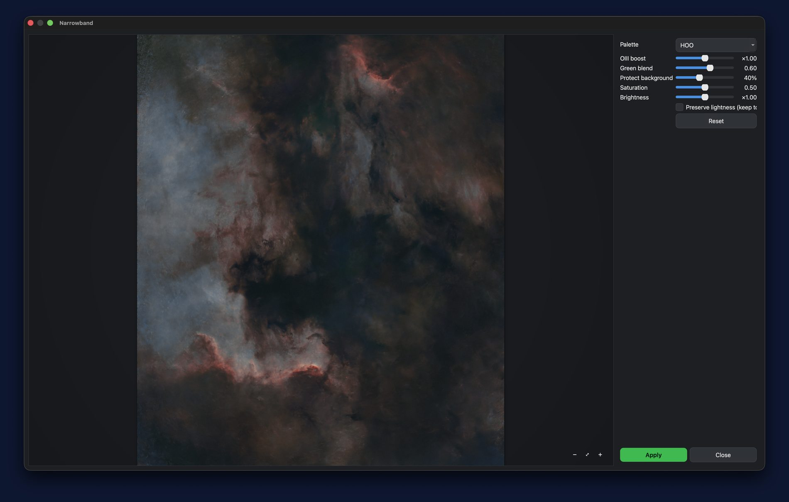

<p align="center">
  
</p>

<h1 align="center">Nocturne</h1>

<p align="center">
  <em>Guided astrophotography processing for smart-telescope stacks.</em><br>
  A free, native desktop app that turns a stacked <strong>ZWO Seestar S30 Pro</strong> image into a finished picture — one guided step at a time.
</p>

---

Like a lot of Seestar owners, you quickly outgrow the phone-app processing and end up bouncing between Siril, PixInsight, GraXpert and RC-Astro — repeating basically the same steps every single time. **Nocturne turns that repetitive workflow into a guided, one-step-at-a-time process**, dedicated to the S30 Pro, with a live preview and full undo at every step.

It's beginner-friendly: it *explains* what each step does and teaches the concepts (linear vs. stretched, dualband/narrowband, why the order matters) as you go — while still driving the same professional tools (GraXpert, RC-Astro) under the hood.

> [!NOTE]
> Nocturne is not affiliated with ZWO, GraXpert, or RC-Astro. It's a personal project — a fan with a Seestar and too many clear-sky ambitions.

## Screenshots

<p align="center">
  <br>
  <em>The guided flow — every step explained, with live stack &amp; sensor details.</em>
</p>
<p align="center">
  <br>
  <em>Plate Solve &amp; Annotate — identify the target and overlay objects, named stars, a compass and a scale bar.</em>
</p>
<p align="center">
  <br>
  <em>Dualband → finished narrowband colour, in one press.</em>
</p>

## Features

- 🪄 **Guided, non-destructive flow** — Crop → Background → Color → Deconvolution → Stretch → Recover Core → Levels → Curves → Saturation → Remove Green → Noise Reduction → Local Contrast → Star Reduction → Enhancements → Export. Each step has simple choices, a live before/after, and full undo / jump-back. Nothing is destructive until you export.
- 🎯 **Plate Solve & Annotate** — solve a frame with **ASTAP** to identify exactly what you shot, then overlay deep-sky object labels, named stars, a compass and a scale bar (they burn into your export).
- 🌡️ **Photometric colour (SPCC)** — calibrate colour against real Gaia catalogue stars in the frame, so the sky is neutral and star colours are true, with an automatic fall-back to sky balance.
- 🌈 **Narrowband, one press** — turn a dualband Ha/OIII master into a finished two-gas colour image (stars removed, nebula colour-mapped, stars screened back), or use the guided Narrowband tool for multiple palettes with a live preview. Ha/OIII channel extraction too.
- 🧱 **Smart stacking & frame grading** — point it at a folder of subs; it grades every frame (flagging clouds and soft stars), rejects the duds, registers (handles alt-az field rotation) and integrates a clean master.
- 🔭 **Real deconvolution, denoise & star tools** — drives **GraXpert** (background extraction, AI denoise) and **RC-Astro** (BlurX / NoiseX / StarX), each with a free fallback so the app works without them.
- ⭐ **Star & tone tools** — star reduction, artistic diffraction spikes, Curves, auto Levels with clipping preview, and HDR core recovery — each with a live preview.
- ✨ **Targeted Enhancements** — tap-to-stack colour boosts (Ha / OIII / blue) and sky darken/lighten, each individually undoable.
- ♻️ **Recipes & batch** — save your steps and apply them to a whole folder.
- 💾 **Export** — 16-bit TIFF / PNG / FITS (WCS preserved), or a starless + stars pair.
- ❓ **Beginner-friendly** — a copyable log/output area, a browsable Help window and a per-step explainer you can collapse once you know the ropes.

## Requirements

- **macOS on Apple Silicon** (M1 or newer) — a prebuilt `Nocturne.app`; see below. There's no Intel-Mac build yet; Windows/Linux is possible from source or via CI — see [Building](#building).
- **[GraXpert](https://www.graxpert.com/)** — free. Powers background/gradient extraction and one of the denoise engines; the one tool worth installing first. Point Nocturne at it in **Settings**.
- **[ASTAP](https://www.hnsky.org/astap.htm)** — free, **optional**. Adds plate-solving, target identification and annotation. Install it *and its D05 star database* (from the ASTAP page), then set the path in Settings.
- **[RC-Astro](https://www.rc-astro.com/) (BlurXTerminator / NoiseXTerminator / StarXTerminator)** — paid, **optional**. Every RC-Astro step has a built-in free fallback, so Nocturne works fully without it — it's simply better with it. Set its path in Settings if you own it.

Nocturne drives these as separate installs and does not bundle them.

## Install

### Download (macOS)

Grab the latest `Nocturne.app` from [Releases](../../releases) (**Apple Silicon**, M1 or newer), drag it to Applications, and open it.

> [!NOTE]
> The app isn't notarized yet, so on first launch macOS may block it. Right-click the app → **Open** → **Open**, or allow it under **System Settings → Privacy & Security**. (Notarization is planned.)

### Run from source

```bash
git clone https://github.com/astehn/nocturne.git
cd nocturne
python3.11 -m venv .venv           # Python 3.11+
source .venv/bin/activate
pip install -e .
python -m nocturne
```

## Quick start

1. Open **Settings** and set your **GraXpert** path (and **RC-Astro** if you have it); press **Test**.
2. **Open FITS** — pick a stacked Seestar master (or use **Stack** to build one from a folder of subs).
3. Step through the pipeline left-to-right; the panel on the right holds each step's controls and explains what it does.
4. For dualband data, use **Colourise** on the Stretch step for one-press colour.
5. Finish at **Export**.

The histogram (top-right) and the log &amp; output areas (bottom) show what each step changed; wheel = zoom, drag = pan; Undo/Redo and Before/After are in the toolbar. With ASTAP set, **Plate Solve** in the toolbar identifies and annotates your target.

## How it works

Raw stacked data is **linear** — nearly black until it's *stretched*. Nocturne's preview auto-stretches for display (like PixInsight's STF); the **Stretch** step commits a real stretch so the finishing steps have real data. Gradient removal and deconvolution belong on linear data (before Stretch); tone and colour polish belong after. The full explanation lives in the in-app **Help**.

## Building

Nocturne is packaged with [PyInstaller](https://pyinstaller.org/):

```bash
pip install pyinstaller matplotlib      # matplotlib is a build-only dep (astropy hook)
pyinstaller packaging/nocturne.spec --noconfirm --workpath build/pyi --distpath dist
```

PyInstaller can't cross-compile, so a Windows `.exe` must be built on Windows (a GitHub Actions `windows-latest` runner is the intended path).

## Built with

The open-source projects doing the real heavy lifting: **PySide6 / Qt** (interface), **NumPy** (numeric backbone), **astropy** (FITS I/O), **SciPy** (filters & maths), **scikit-image** (image operations), **astroalign** (registration), **SEP** (star grading), **colour-demosaicing** (debayer), **tifffile** (16-bit TIFFs), **Pillow** (image I/O). Works alongside **GraXpert** and **RC-Astro**.

## Credits

Created and directed by **Andreas Stehn** — chief orchestrator & ideas department. Code wrangled in collaboration with **Claude (Anthropic)**.

Test data from the community is hugely appreciated and credited in-app as **Photon Donors** ⭐ — see the [data request](docs/announcement.md). Donated data is used **only** to test and improve Nocturne.

## License

Nocturne is released under the **GNU General Public License v3.0** — see [LICENSE](LICENSE). You're free to use, study, change, and share it; any distributed modifications must remain open-source under the GPL.
