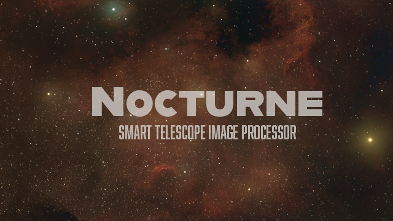

<p align="center">
  
</p>

<h1 align="center">Nocturne</h1>

<p align="center">
  <em>Guided astrophotography processing for smart-telescope stacks.</em><br>
  A free, native desktop app that turns a stacked <strong>ZWO Seestar S30 Pro</strong> image into a finished picture — one guided step at a time.
</p>

---

Like a lot of Seestar owners, you quickly outgrow the phone-app processing and end up bouncing between Siril, PixInsight, GraXpert and RC-Astro — repeating basically the same steps every single time. **Nocturne turns that repetitive workflow into a guided, one-step-at-a-time process**, dedicated to the S30 Pro, with a live preview and full undo at every step.

It's beginner-friendly: it *explains* what each step does and teaches the concepts (linear vs. stretched, dualband/narrowband, why the order matters) as you go — while still driving the same professional tools (GraXpert, RC-Astro) under the hood.

> [!NOTE]
> Nocturne is not affiliated with ZWO, GraXpert, or RC-Astro. It's a personal project — a fan with a Seestar and too many clear-sky ambitions.

## Screenshots

<!-- Add UI screenshots here, e.g. the guided flow and a colourised result. -->
> _Screenshots coming — drop images into `docs/img/` and reference them here._

## Features

- 🪄 **Guided, non-destructive flow** — Crop → Background → Color → Deconvolution → Stretch → Levels → Saturation → Noise Reduction → Local Contrast → Star Reduction → Enhancements → Export. Each step has simple Light/Medium/Strong choices, a live before/after, and full undo / jump-back. Nothing is destructive until you export.
- 🎨 **One-press Colourise** — turn a raw dualband (Ha/OIII) master into a finished colour image in a single press (Foraxx-style): stars removed, the starless nebula colour-mapped, stars screened back. Advanced sliders if you want to tune.
- 🔭 **Real deconvolution & star tools** — integrates **GraXpert** (background extraction) and **RC-Astro** (BlurX / NoiseX / StarX), each with a free fallback so the app works without them.
- 🧱 **Built-in stacking** — point it at a folder of subs; it grades/rejects, registers (handles alt-az field rotation), and integrates a master.
- 🌈 **Ha / OIII extraction** — split a dualband master into separate Ha and OIII channels for external work.
- ✨ **Targeted Enhancements** — tap-to-stack colour boosts (Ha / OIII / blue) and sky darken/lighten, each individually undoable.
- ♻️ **Recipes & batch** — save your steps and apply them to a whole folder.
- 💾 **Export** — 16-bit TIFF / PNG / FITS, or a starless + stars pair.
- ❓ **Comprehensive in-app Help** — a browsable guide plus a per-step explainer, written for people new to astro processing.

## Requirements

- **macOS** (a prebuilt `Nocturne.app`; see below). Building for Windows/Linux is possible from source or via CI — see [Building](#building).
- **[GraXpert](https://www.graxpert.com/)** — free, **required** for background extraction. Install it, then point Nocturne at it in **Settings**.
- **[RC-Astro](https://www.rc-astro.com/) (BlurXTerminator / NoiseXTerminator / StarXTerminator)** — paid, **optional**. Every RC-Astro step has a built-in free fallback, so Nocturne works fully without it — it's simply better with it. Set its path in Settings if you own it.

Nocturne drives these as separate installs and does not bundle them.

## Install

### Download (macOS)

Grab the latest `Nocturne.app` from [Releases](../../releases), drag it to Applications, and open it.

> [!NOTE]
> The app isn't notarized yet, so on first launch macOS may block it. Right-click the app → **Open** → **Open**, or allow it under **System Settings → Privacy & Security**. (Notarization is planned.)

### Run from source

```bash
git clone <repo-url> nocturne
cd nocturne
python3.11 -m venv .venv           # Python 3.11+
source .venv/bin/activate
pip install -e .
python -m nocturne
```

## Quick start

1. Open **Settings** and set your **GraXpert** path (and **RC-Astro** if you have it); press **Test**.
2. **Open FITS** — pick a stacked Seestar master (or use **Stack** to build one from a folder of subs).
3. Step through the pipeline left-to-right; the panel on the right holds each step's controls and explains what it does.
4. For dualband data, use **Colourise** on the Stretch step for one-press colour.
5. Finish at **Export**.

The histogram (top-right) and the log (bottom) show what each step changed; wheel = zoom, drag = pan; Undo/Redo and Before/After are in the toolbar.

## How it works

Raw stacked data is **linear** — nearly black until it's *stretched*. Nocturne's preview auto-stretches for display (like PixInsight's STF); the **Stretch** step commits a real stretch so the finishing steps have real data. Gradient removal and deconvolution belong on linear data (before Stretch); tone and colour polish belong after. The full explanation lives in the in-app **Help**.

## Building

Nocturne is packaged with [PyInstaller](https://pyinstaller.org/):

```bash
pip install pyinstaller matplotlib      # matplotlib is a build-only dep (astropy hook)
pyinstaller packaging/nocturne.spec --noconfirm --workpath build/pyi --distpath dist
```

PyInstaller can't cross-compile, so a Windows `.exe` must be built on Windows (a GitHub Actions `windows-latest` runner is the intended path).

## Built with

The open-source projects doing the real heavy lifting: **PySide6 / Qt** (interface), **NumPy** (numeric backbone), **astropy** (FITS I/O), **SciPy** (filters & maths), **scikit-image** (image operations), **astroalign** (registration), **SEP** (star grading), **colour-demosaicing** (debayer), **tifffile** (16-bit TIFFs), **Pillow** (image I/O). Works alongside **GraXpert** and **RC-Astro**.

## Credits

Created and directed by **Andreas Stehn** — chief orchestrator & ideas department. Code wrangled in collaboration with **Claude (Anthropic)**.

Test data from the community is hugely appreciated and credited in-app as **Photon Donors** ⭐ — see the [data request](docs/announcement.md). Donated data is used **only** to test and improve Nocturne.

## License

_To be finalised (MIT or GPL) — see `LICENSE`._
